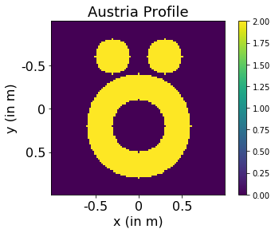

Welcome to the DL in Inverse Scattering Tutorial. Through this notebook, we aim to provide a step-by-step introduction to codes used in implemenation of the scheme provided in <i>Embedding Deep Learning in Inverse Scattering Problem</i>. After going through this notebook, one can perform the numerical experiments themselves to generate the results presented in our aforementioned paper.


To start off, we firstly need to initialize some problem parameters. Since our scheme is heavily using Subspace Optimization Method (SOM), we use the parameters as ones used in the original SOM paper i.e. <a href = "https://ieeexplore.ieee.org/abstract/document/5210141">Subspace-Based Optimization Method for Solving Inverse-Scattering Problems</a>.

The imaging domain, $D$, is assumed to be of size $2m \times 2m$ and the object of interest is located within this domain. The incident field is $400MHz$, and hence the free space wavelength is $\lambda = 0.75m$. The measurements are taken on a circle of radius $R_S = 4m$ with the centre of the circle coinciding with the center of $D$ and $N_s = 32$ receivers are placed along the measurement domain in an equiangular manner for each illuminations. Total number of different illuminations are $N_I = 16$ and the corresponding transceivers are placed on the radius $R_i = 6m$.


```python
import numpy as np

# Frequency = 400MHz
f = 4e8
wavelength = 3e8/f

# k := Wavenumber
k = 2*np.pi/wavelength 

# d := Dimension of imaging domain D in meters
d = 2 

# R := Radius of measurement domain
R = 4

# M := Number of Receivers per illumination
M = 32

# V := Number of illuminations
V = 16
```

Given these paramters, we can generate other quantities such as positions of discretized grids, receivers and transceivers. Additionally, we also need the incident field vector for the inverse scattering problem


```python
import sys
sys.path.insert(0, './utility/')
import setup_functions

# The imaging domain is discretized into L X L cells
L = 32 
# Dimension of one cell
n = d/L 
# Number of pixels
N = L^2

# Positions of center of each grid. Shape = [N, 2]
# pos_D[i,:] = [x coordinate, y coordinate] of cell #i 
pos_D = setup_functions.gen_pos_D(d,L,n)

# Positions of Receivers and Transceivers. Shape = [M,2] and [V,2] respectively
# pos_S[i,:] = [x coordinate, y coordinate] of receiver #i 
pos_S = setup_functions.gen_pos_S(R, M, d) 
# pos_Tx[i,:] = [x coordinate, y coordinate] of transceiver #i 
pos_Tx = setup_functions.gen_pos_Tx(R*1.5, V, d)

# Incident Field, Shape = [N,1] (Complex vector)
e = setup_functions.gen_e(k, pos_D, pos_Tx)
```

Next, we need the scattered fields which will be used to obtain the dielectric profile. In absence of actual data, we simulate the experimental data by running the forward solver at a higher resolution ($L = 100$) in this case. 


```python
# For forward solver
L_forward = 100
n_forward = d/L_forward

pos_D_forward = setup_functions.gen_pos_D(d,L_forward,n_forward)
e_forward = setup_functions.gen_e(k, pos_D_forward, pos_Tx)
```

We use the CG-FFT forward solver to find out the internal fields and then calculate the scattered fields at external points using the matrix $G_S$. The process can be summarized as follows:
$$d_n =  e_n + G_DXe_n$$
$$\Rightarrow w_n = Xe_n + XG_Dw_n$$
$$ s_n = G_S w_n $$

Note that the symbols used have the same meaning as those defined in our paper.


```python
import util_cgfft
import util_functions
# Forward Solver parameters for L = 100 
# FFT representation of G_D matrix
g_D_forward, g_D_fft_forward, g_D_fft_conj_forward = util_cgfft.construct_g_D(pos_D_forward, k, n_forward)

# G_S matrix for forward solver
G_S_forward = util_functions.construct_G_S(pos_D_forward, pos_S, k, n_forward)

# Forward Solver parameters for L = 32 
# FFT representation of G_D matrix
g_D, g_D_fft, g_D_fft_conj = util_cgfft.construct_g_D(pos_D, k, n)

# G_S matrix for forward solver
G_S = util_functions.construct_G_S(pos_D, pos_S, k, n)

## Ignore the warning which comes after running the code
```

    /home/yashsanghvi/.local/lib/python3.5/site-packages/scipy/fftpack/basic.py:160: FutureWarning: Using a non-tuple sequence for multidimensional indexing is deprecated; use `arr[tuple(seq)]` instead of `arr[seq]`. In the future this will be interpreted as an array index, `arr[np.array(seq)]`, which will result either in an error or a different result.
      z[index] = x


But what object we are going to run the forward solver on? We use the Austria profile which is often used to validate inverse scattering algorithms. However, we increase the contrast of the profile to make an electrically stronger object for which conventional algorithms fail


```python
import generate_shapes
import matplotlib.pyplot as plt

max_contrast = 2.0
x_au = generate_shapes.austria_multicontrast(L_forward,max_contrast,max_contrast,max_contrast)

# Display Austria Profile
plt.imshow(np.real(x_au))
plt.xticks([L_forward*0.25, L_forward*0.5, L_forward*0.75], [-0.5, 0, 0.5],fontsize = '16')
plt.yticks([L_forward*0.25, L_forward*0.5, L_forward*0.75], [-0.5, 0, 0.5],fontsize = '16')
plt.xlabel('x (in m)', fontsize='16')
plt.ylabel('y (in m)', fontsize='16')
plt.title('Austria Profile', fontsize='18')
plt.colorbar()
```


    <matplotlib.colorbar.Colorbar at 0x7f86a16871d0>





```python
# Generating scattered field from profile
# Reshape profile into [N,1] vector
x = np.reshape(x_au,[L_forward*L_forward,1])
# Run the forward solver
y, _ = util_cgfft.cg_fft_forward_problem(x, G_S_forward, g_D_fft_forward, e_forward, 1e-6, e_forward, 1000)
# Add 25dB Gaussian Noise
y = util_functions.add_noise(y, 25)
```


    Tolerance = 0.366e-6 at iteration = 58 for 1th illumination
    Tolerance = 0.135e-6 at iteration = 69 for 2th illumination
    Tolerance = 0.878e-6 at iteration = 57 for 3th illumination
    Tolerance = 0.655e-6 at iteration = 59 for 4th illumination
    Tolerance = 0.094e-6 at iteration = 43 for 5th illumination
    Tolerance = 0.720e-6 at iteration = 58 for 6th illumination
    Tolerance = 0.790e-6 at iteration = 57 for 7th illumination
    Tolerance = 0.426e-6 at iteration = 61 for 8th illumination
    Tolerance = 0.574e-6 at iteration = 59 for 9th illumination
    Tolerance = 0.215e-6 at iteration = 58 for 10th illumination
    Tolerance = 0.705e-6 at iteration = 58 for 11th illumination
    Tolerance = 0.916e-6 at iteration = 58 for 12th illumination
    Tolerance = 0.235e-6 at iteration = 43 for 13th illumination
    Tolerance = 0.677e-6 at iteration = 58 for 14th illumination
    Tolerance = 0.057e-6 at iteration = 63 for 15th illumination
    Tolerance = 0.749e-6 at iteration = 57 for 16th illumination


```python

```
